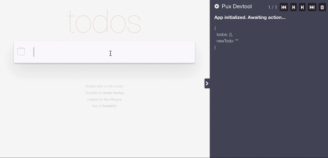

# pux-devtool

> DevTools extension for
> [Pux](https://github.com/alexmingoia/purescript-pux) applications.

Visualize app state and events.

- Show current event
- Inspect current state
- Time-travel between application states

## Chrome Extension

Install the Chrome extension from the [Chrome Web Store](https://chrome.google.com/webstore/detail/pux-devtool/ecolgfgmnimnllbgllbpfmnehejockmk).

## Firefox Extension

Install the FireFox extension by going to Add-Ons -> Install Add-On From File...
-> then choose [pux_devtool-1.0.2-an+fx.xpi](https://github.com/alexmingoia/pux-devtool/tree/master/dist/firefox).
